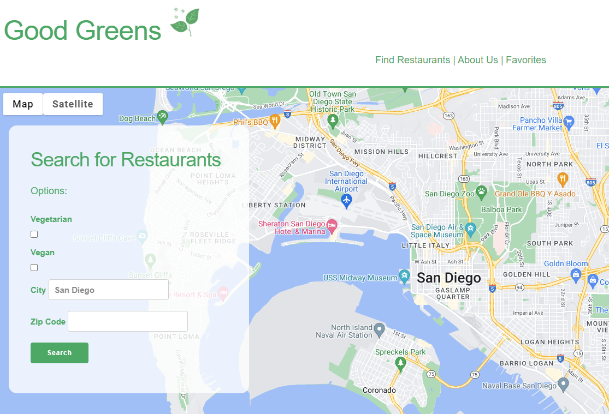
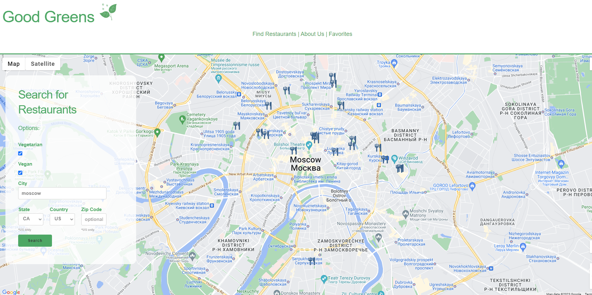
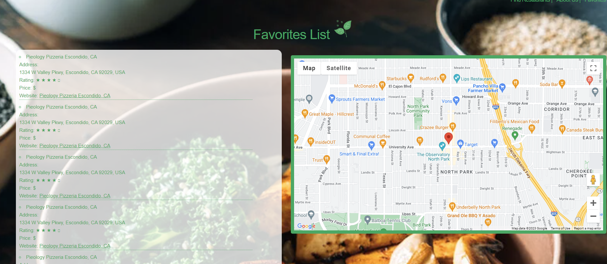

# Good Greens Project #1

## User Story:

```
AS A global citizen and a lover of vegan and/or vegetarian food,
I WANT a website that can provide me with vegetarian and/or vegan restaurants and eateries anywhere in the world.
SO THAT I can quickly find places to eat near me.
```

## Acceptance Criteria

```
Given a restaurant finder with location inputs
WHEN I select vegan and/or vegetarian and enter location details
THEN I am presented with a map and a list of restaurant suggestions near that location
WHEN I view a list of vegan and/or vegetarian restaurant suggestions
THEN I can see the restaurant's name, address, rating, price level, website link, and favorite button
WHEN I click on a restaurant on the list,
THEN I can see that the map on the page centers itself on the restaurant's location
WHEN I click on one of the restaurant's favorte button
THEN I save that restaurant's information to the favorites page
WHEN I click on the favorites link in the navigation bar
THEN I am presented with a list of all restaurants that I have saved, with their information, and map location
```
## Functionality 
Upon opening, the site should appear as so:


The site offers both national and international search options. Upon entering a city name of the user's choice, the map will display surrounding restaurant options.


When choosing a "favorite restaurant from the search list, you will get an alert, and can access the site from your local storage on the "favorites" page:


## Resources
Google Places: https://developers.google.com/maps/documentation/places/web-service/overview

Weather API: https://openweathermap.org/api

Skeleton CSS: http://getskeleton.com/

Foundation6: https://get.foundation/building-blocks/index-2.html

Polyfill: https://polyfill.io/v3/api/
